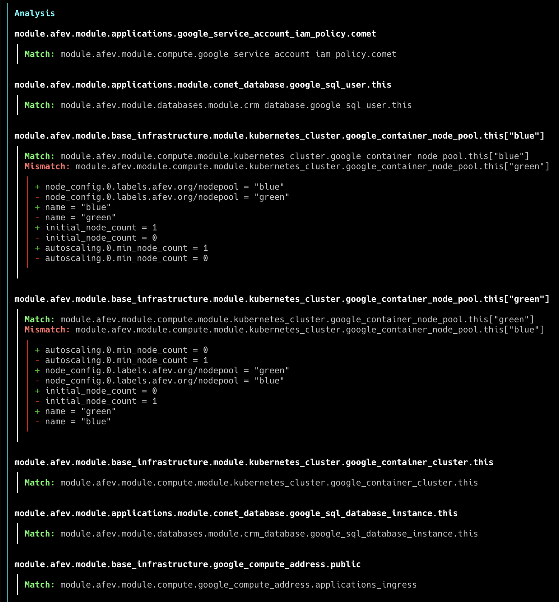

# Automatic Terraform `moved` blocks <!-- omit in toc -->

[](https://opensource.org/licenses/Apache-2.0)
[](https://goreportcard.com/report/github.com/padok-team/tfautomv)


When refactoring a Terraform codebase, you often need to write [`moved` blocks](https://www.terraform.io/language/modules/develop/refactoring#moved-block-syntax). This can be tedious. Let
`tfautomv` do it for you.

- [How does it work?](#how-does-it-work)
- [Goals](#goals)
- [Installation](#installation)
- [Usage](#usage)
  - [Ignore certain differences](#ignore-certain-differences)
  - [Detailed analysis](#detailed-analysis)
  - [Output options](#output-options)
- [Known issues](#known-issues)
- [License](#license)

## How does it work?

When you move a resource in your code, Terraform loses track of the resource's
state. The next time you run Terraform, it will plan to delete the resource it
has memory of and create the "new" resource it found in your refactored code.

`tfautomv` inspects the output of `terraform plan`, detects such
creation/deletion pairs and writes a `moved` block so that Terraform now knows
no deletion or creation is required.

To match resources, `tfautomv` looks for resources of the same type with
identical attributes. If a single match is found, then it writes a `moved`
block.

For more details, see [docs/design.md](./docs/design.md).

## Goals

This project's goals are, in order:

1. `tfautomv` should be certain of the matches it finds
2. `tfautomv` should be quick and painless to use
3. `tfautomv` should be idempotent

## Installation

With Homebrew:

```bash
brew tap padok-team/tap
brew install tfautomv
```

Pre-compiled binaries are available on the [Releases page](https://github.com/padok-team/tfautomv/releases). You can download the binary that matches your workstation
and add it to your PATH.

You can also compile `tfautomv` from source. You must have [Go installed](https://go.dev/doc/install). This command writes a fresh binary to `bin/tfautomv`:

```bash
make build
```

## Usage

In any directory where you would run `terraform plan`, simply run:

```bash
tfautomv
```

In the background, `tfautomv` will run `terraform init` and `terraform plan`.

### Ignore certain differences

The `--ignore` flag allows you to ignore differences between certain resources'
attributes.

Rules have the following syntax:

```plaintext
<EFFECT>:<RESOURCE TYPE>:<ATTRIBUTE NAME>
```

For example:

```bash
tfautomv --ignore=everything:random_pet:length
```

For nested attributes, separate parent attributes from child attributes with a
`.` (the representation used in tfautomv's detailed analysis):

```bash
<EFFECT>:<RESOURCE TYPE>:parent_obj.child_field
<EFFECT>:<RESOURCE TYPE>:parent_list.0
```

You can use the `--ignore` flag multiple times to specify multiple rules.

The following effects are available:

- `everything`: ignores all differences between attribute values
- `whitespace`: ignores whitespace when comparing attribute values

### Detailed analysis

For details on which resources match and which don't, use the `--show-analysis`
flag. Output looks like this:



### Output options

There are multiple output options supported, that you can enable with flags:

- `--output=blocks` (default): appends `moved` blocks to a `moves.tf` file
- `--output=commands`: prints `terraform state mv` commands to standard output
- `--dry-run`: prints moves in human-readable format

## Known issues

Some configurations make it so that `tfautomv` cannot be certain about which
resource matches which. For more information, see the failing
`TestE2E/dependencies` test in the `internal/e2e` package.

## License

The code is licensed under the permissive Apache v2.0 license. [Read this](<https://tldrlegal.com/license/apache-license-2.0-(apache-2.0)>) for a summary.
