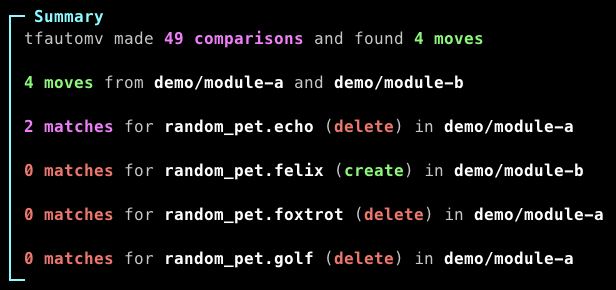
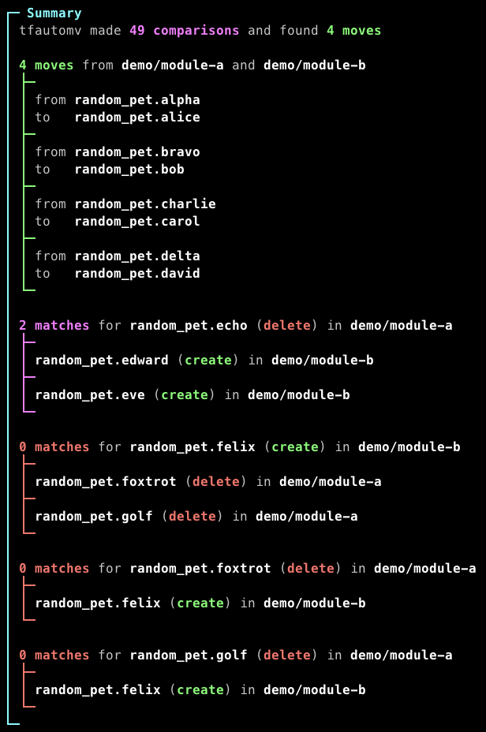
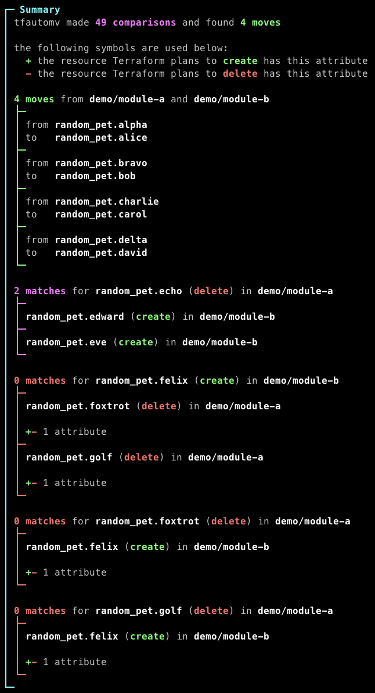
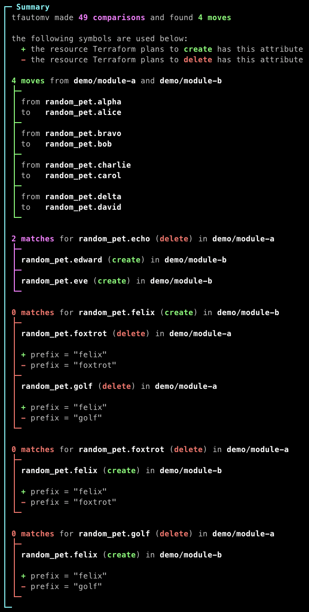

# tfautomv

[](https://opensource.org/licenses/Apache-2.0)
[](https://github.com/busser/tfautomv/releases/latest)
[](https://goreportcard.com/report/github.com/busser/tfautomv)

Generate `moved` blocks and state move commands automatically for Terraform and OpenTofu.

> [!NOTE]
> **Status: stable.** Used in production. Maintenance is mostly dependency updates: no new features are planned, but bug reports are welcome. Still v0.x because some internals may change in major ways before 1.0.

When you rename or move a resource in your Terraform code, Terraform loses track of the resource's state. The next plan shows the original resource being destroyed and a "new" one created in its place. `tfautomv` inspects the plan, detects these create/delete pairs, and writes [`moved` blocks](https://developer.hashicorp.com/terraform/language/modules/develop/refactoring#moved-block-syntax) (or `terraform state mv` commands) so Terraform updates state in place without touching infrastructure.

For example, after renaming `aws_instance.web` to `aws_instance.web_server`:

```terraform
resource "aws_instance" "web_server" {
  ami           = "ami-12345"
  instance_type = "t2.micro"
}
```

Running `tfautomv` produces a `moves.tf` file:

```terraform
moved {
  from = aws_instance.web
  to   = aws_instance.web_server
}
```

The next `terraform plan` shows no changes.


## Installation

### Homebrew

On MacOS or Linux:

```bash
brew install busser/tap/tfautomv
```

### Shell script

On MacOS or Linux:

```bash
curl -sSfL https://raw.githubusercontent.com/busser/tfautomv/main/install.sh | sh
```

### Other methods

<details>
<summary>Yay (Arch Linux), asdf, manual download, from source</summary>

**Yay** (Arch Linux):

```bash
yay tfautomv-bin
```

**asdf** version manager:

```bash
asdf plugin add tfautomv https://github.com/busser/asdf-tfautomv.git
```

**Manual download:** grab a binary from the [Releases page](https://github.com/busser/tfautomv/releases) and put it in a directory on your `PATH`.

**From source** (requires Go 1.18+):

```bash
git clone https://github.com/busser/tfautomv
cd tfautomv
make build
```

Then move `bin/tfautomv` to a directory on your `PATH`.

_Contributions to support other installation methods, including Windows for the shell script, are welcome._

</details>

## Usage

Run `tfautomv` in any directory where you would run `terraform plan`:

```bash
tfautomv
```

This runs `terraform init`, `terraform refresh`, and `terraform plan`, then writes `moved` blocks to a `moves.tf` file. You can also target a specific working directory:

```bash
tfautomv ./production
```

### Output formats

By default, tfautomv writes `moved` blocks. Force `moved` blocks only with `--output=blocks`:

```bash
tfautomv --output=blocks
```

Force `terraform state mv` commands with `--output=commands`. The commands are printed to stdout, so you can review them, save them to a file, or pipe to a shell:

```bash
tfautomv --output=commands              # print to stdout
tfautomv --output=commands > moves.sh   # save to a file
tfautomv --output=commands | sh         # run immediately
```

`-o` is shorthand for `--output`.

### Moving resources across directories

If you have multiple Terraform modules in different directories, pass them all to `tfautomv`:

```bash
tfautomv ./production/main ./production/backup -o commands
```

This runs `terraform init`, `refresh`, and `plan` in each directory, then writes `terraform state mv` commands to standard output. The commands move resources within and across directories as needed.

Terraform does not natively support moving resources across directories. To work around this, the generated commands pull copies of each directory's state, perform the moves locally, and push the new state back. You can pass as many directories as you want.

This requires the `commands` output format. Terraform's `moved` block syntax does not support cross-directory moves.

### Skipping init and refresh

`tfautomv` runs `init` and `refresh` by default. To skip them and iterate faster:

```bash
tfautomv --skip-init --skip-refresh
# or, equivalently:
tfautomv -sS
```

## Best practices

`tfautomv` is for **pure refactoring**: restructuring code without changing infrastructure. Mixing refactoring with configuration changes (renaming a resource AND modifying its tags in the same step, for example) leads to bad matches or surprise infrastructure changes.

Recommended workflow:

1. Make structural changes only (rename, move between modules, switch to `for_each`).
2. Run `tfautomv` and apply the resulting moves. Plan should show no infrastructure changes.
3. In a separate change, modify resource attributes as needed.

## Debugging unmatched resources

If a resource you expected to be matched is not, increase verbosity with `-v` (up to `-vvv`) to see why:

```bash
tfautomv -vvv
```

|                     level 0 (default)                     |                      level 1 (`-v`)                       |                      level 2 (`-vv`)                      |                     level 3 (`-vvv`)                      |
| :-------------------------------------------------------: | :-------------------------------------------------------: | :-------------------------------------------------------: | :-------------------------------------------------------: |
|  |  |  |  |

The output shows which attributes differ between create/delete pairs. Based on what you see, you can edit your code, write a `moved` block manually, or use `--ignore` (below) to skip specific differences.

## Ignoring differences

`tfautomv` matches resources by comparing all their attributes. Sometimes a Terraform provider transforms an attribute's value (normalizing JSON whitespace, adding a prefix, etc.) so the value in your code never matches the value in state. The `--ignore` flag tells tfautomv to skip specific attributes during comparison.

> [!WARNING]
> Use `--ignore` for **provider quirks**, not for **configuration changes you made on purpose**. Forcing a match by ignoring an attribute you intended to change can produce unintended infrastructure changes when the move is applied. If you find yourself reaching for `--ignore` because you changed a value, that's a sign refactoring and configuration changes have been mixed: separate them (see [Best practices](#best-practices)).

A rule looks like this:

```plaintext
<KIND>:<RESOURCE TYPE>:<ATTRIBUTE NAME>[:<KIND ARGUMENTS>]
```

You can pass `--ignore` multiple times:

```bash
tfautomv \
  --ignore="whitespace:azurerm_api_management_policy:xml_content" \
  --ignore="prefix:google_storage_bucket_iam_member:bucket:b/"
```

### Available kinds

- **`everything`**: ignore any difference. Example: `--ignore="everything:random_pet:length"`
- **`whitespace`**: ignore whitespace differences (useful for provider-formatted JSON or XML). Example: `--ignore="whitespace:aws_iam_policy:policy"`
- **`prefix`**: strip a fixed prefix before comparing. Example: `--ignore="prefix:google_storage_bucket_iam_member:bucket:b/"`

<details>
<summary>Detailed examples for each kind</summary>

**`whitespace`** allows these two resources to match despite different formatting:

```terraform
resource "azurerm_api_management_policy" "foo" {
  api_management_id = "..."

  xml_content = <<-EOT
  <policies>
    <inbound>
      <cross-domain />
      <base />
      <find-and-replace from="xyz" to="abc" />
    </inbound>
  </policies>
  EOT
}

resource "azurerm_api_management_policy" "bar" {
  api_management_id = "..."

  xml_content = "<policies><inbound><cross-domain /><base /><find-and-replace from=\"xyz\" to=\"abc\" /></inbound></policies>"
}
```

**`prefix`** with `b/` strips that prefix before comparing the `bucket` attribute, useful when a provider stores `b/my-bucket` in state but the configuration sets `my-bucket`.

</details>

If you have a use case the existing kinds don't cover, please open an issue so we can track demand.

### Nested attributes

Join parent and child attributes with `.`:

```plaintext
<KIND>:<RESOURCE TYPE>:parent_obj.child_field
<KIND>:<RESOURCE TYPE>:parent_list.0
```

To find an attribute's full path, run `tfautomv -vvv` and read the verbosity output.

## Tool integration

### Passing extra arguments to Terraform

Use Terraform's built-in [`TF_CLI_ARGS` and `TF_CLI_ARGS_name` environment variables](https://www.terraform.io/cli/config/environment-variables#tf_cli_args-and-tf_cli_args_name). For example:

```bash
TF_CLI_ARGS_plan="-var-file=production.tfvars" tfautomv
```

### OpenTofu

OpenTofu is supported out of the box via the `--terraform-bin` flag:

```bash
tfautomv --terraform-bin=tofu
```

This works with all features, including `moved` blocks, `tofu state mv` commands, and `--preplanned`.

### Terragrunt

Terragrunt does not work directly with `--terraform-bin=terragrunt` because Terragrunt's CLI does not behave identically to Terraform's. A wrapper script can bridge the gap. See [issue #127](https://github.com/busser/tfautomv/issues/127) for the current discussion and an example wrapper.

### Other Terraform-compatible tools

The `--terraform-bin` flag works with any executable that exposes `init` and `plan` commands compatible with Terraform.

## Using existing plan files

If you've already generated Terraform plan files, the `--preplanned` flag tells tfautomv to use them instead of running `terraform plan`. This is useful for:

- **Performance**: avoid re-running plans while iterating on `--ignore` rules.
- **Enterprise environments**: where running Terraform locally is impractical due to secrets or remote state.
- **CI/CD workflows**: where plans are generated in earlier pipeline stages.
- **Remote workspaces** (TFE/Cloud): where you can download JSON plans but can't run Terraform locally.

Basic usage:

```bash
terraform plan -out=tfplan.bin
tfautomv --preplanned
```

<details>
<summary>Custom file paths, multiple directories, JSON vs binary plans</summary>

**Custom plan file path:**

```bash
terraform plan -out=my-plan.bin
tfautomv --preplanned --preplanned-file=my-plan.bin
```

**Multiple directories** (each must have its own plan file):

```bash
(cd production && terraform plan -out=tfplan.bin)
(cd staging && terraform plan -out=tfplan.bin)
tfautomv --preplanned production staging
```

**JSON vs binary plans.** tfautomv detects the format from the file extension:

- Binary plans (default): tfautomv runs `terraform show -json` to convert them.
- JSON plans (`.json` extension): read directly.

```bash
terraform show -json tfplan.bin > tfplan.json
tfautomv --preplanned --preplanned-file=tfplan.json
```

If any specified directory is missing its plan file, tfautomv exits with an error.

</details>

## Disabling colors

Pass `--no-color` or set the `NO_COLOR` environment variable to any value:

```bash
tfautomv --no-color
NO_COLOR=true tfautomv
```

## Requirements

`tfautomv` shells out to the Terraform (or OpenTofu) CLI, so it works with any compatible version. Specific features have minimum version requirements:

- `moved` blocks: Terraform v1.1+
- Cross-module `terraform state mv` commands: Terraform v0.14+
- Single-module `terraform state mv` commands: Terraform v0.13+

## Thanks

Thanks to [Padok](https://www.padok.fr), where this project was born 💜

## License

Apache 2.0. [Summary](<https://tldrlegal.com/license/apache-license-2.0-(apache-2.0)>).
