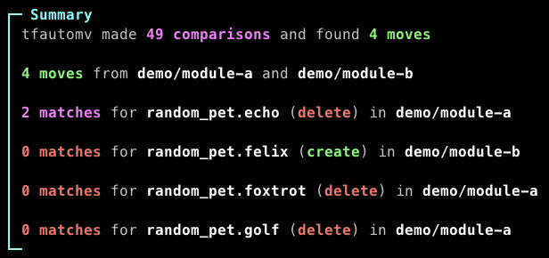
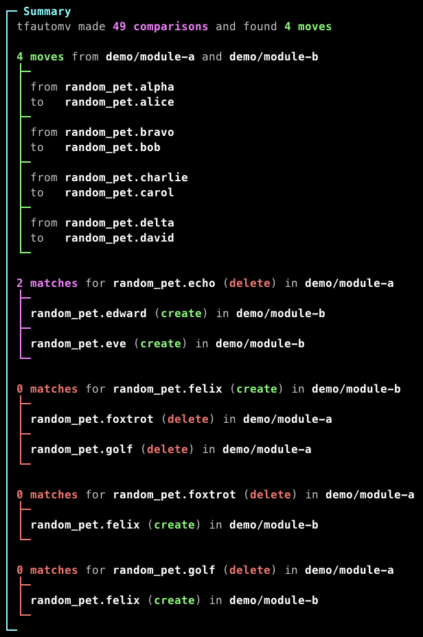
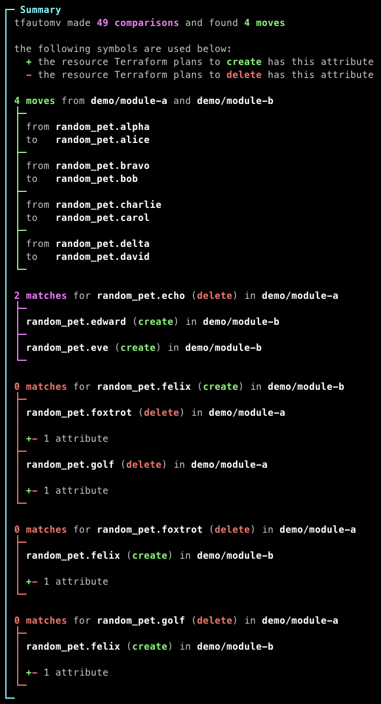
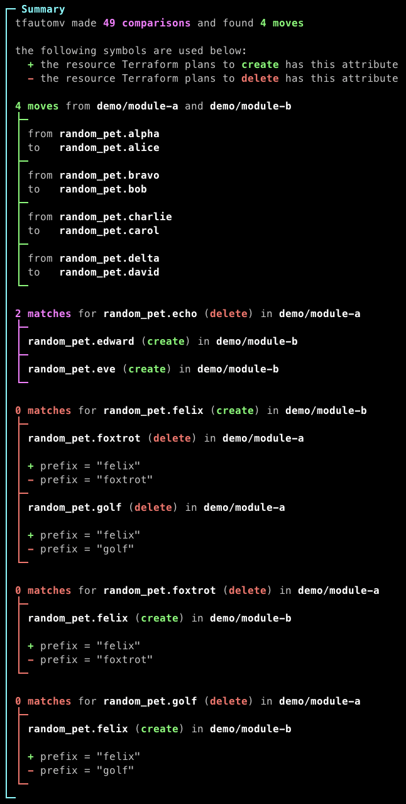

# tfautomv <!-- omit in toc -->

[](https://opensource.org/licenses/Apache-2.0)
[](https://github.com/busser/tfautomv/releases/latest)
[](https://goreportcard.com/report/github.com/busser/tfautomv)

Generate Terraform `moved` blocks automatically.

- [Why?](#why)
- [Requirements](#requirements)
- [Installation](#installation)
  - [Homebrew](#homebrew)
  - [Yay](#yay)
  - [asdf](#asdf)
  - [Shell script](#shell-script)
  - [Download](#download)
  - [From source](#from-source)
- [Usage](#usage)
  - [Generating `moved` blocks](#generating-moved-blocks)
  - [Generating `terraform state mv` commands](#generating-terraform-state-mv-commands)
  - [Finding moves across multiple directories](#finding-moves-across-multiple-directories)
  - [Skipping the `init` and `refresh` steps](#skipping-the-init-and-refresh-steps)
  - [Understanding why a resource was not moved](#understanding-why-a-resource-was-not-moved)
  - [Ignoring certain differences](#ignoring-certain-differences)
    - [The `everything` kind](#the-everything-kind)
    - [The `whitespace` kind](#the-whitespace-kind)
    - [The `prefix` kind](#the-prefix-kind)
    - [Referencing nested attributes](#referencing-nested-attributes)
  - [Passing additional arguments to Terraform](#passing-additional-arguments-to-terraform)
  - [Using Terragrunt instead of Terraform](#using-terragrunt-instead-of-terraform)
  - [Disabling colors in output](#disabling-colors-in-output)
  - [Run tfautomv against a plan file](#run-tfautomv-against-a-plan-file)
- [Thanks](#thanks)
- [License](#license)

## Why?

`tfautomv` (a.k.a Terraform auto-move) is a refactoring helper. With it, making
structural changes to your Terraform codebase becomes much easier.

When you move a resource in your code, Terraform loses track of the resource's
state. The next time you run Terraform, it will plan to delete the resource it
has memory of and create the "new" resource it found in your refactored code.

`tfautomv` inspects the output of `terraform plan`, detects such
creation/deletion pairs and writes a [`moved` block](https://developer.hashicorp.com/terraform/language/modules/develop/refactoring#moved-block-syntax)
so that Terraform now knows no deletion or creation is required.

We explain why we built tfautomv in more detail [in this blog article](https://www.padok.fr/en/blog/terraform-refactoring-tfautomv).

Here's a quick view of what `tfautomv` does:


## Requirements

`tfautomv` uses the Terraform CLI command under the hood. This allows it to work
with any Terraform version reliably.

Certain features require specific versions of Terraform:

- `moved` blocks require Terraform v1.1 or above
- cross-module `terraform state mv` commands require Terraform v0.14 or above
- single-module `terraform state mv` commands require Terraform v0.13 or above

## Installation

_Contributions to support other installation methods are welcome!_

### Homebrew

On MacOS or Linux:

```bash
brew install busser/tap/tfautomv
```

### Yay

On Arch Linux:

```bash
yay tfautomv-bin
```

### asdf

With asdf version manager:

```bash
asdf plugin add tfautomv https://github.com/busser/asdf-tfautomv.git
```

### Shell script

On MacOS or Linux:

```bash
curl -sSfL https://raw.githubusercontent.com/busser/tfautomv/main/install.sh | sh
```

_This script can probably support Windows with a small amount of work.
Contributions welcome!_

### Download

On the Github repository's [Releases page](https://github.com/busser/tfautomv/releases),
download the binary that matches your workstation's OS and CPU architecture.

Put the binary in a directory present in your system's `PATH` environment
variable.

### From source

You must have Go 1.18+ installed to compile tfautomv.

Clone the repository and build the binary:

```bash
git clone https://github.com/busser/tfautomv
cd tfautomv
make build
```

Then, move `bin/tfautomv` to a directory resent in your system's `PATH`
environment variable.

## Usage

### Generating `moved` blocks

In any directory where you would run `terraform plan`, you can run:

```bash
tfautomv
```

This will run `terraform init`, `terraform refresh`, and `terraform plan`, and
then write `moved` blocks to a `moves.tf` file.

That's all there is to it!

You can also target a specific working directory:

```bash
tfautomv ./production
```

### Generating `terraform state mv` commands

By default, tfautomv writes moves to as `moved` blocks when possible and falls
back to `terraform state mv` commands when not.

You can force `tfautomv` to write only `moved` blocks with the `--output=moves`
flag:

```bash
tfautomv --output=moves
```

You can force `tfautomv` to write only `terraform state mv` commands with the
`--output=commands` flag:

```bash
tfautomv --output=commands
```

This will print commands to standard output. You can copy and paste them to a
terminal to run them manually.

Alternatively, you can write the commands to a file:

```bash
tfautomv --output=commands > moves.sh
```

Or pipe them into a shell to run them immediately:

```bash
tfautomv --output=commands | sh
```

The `-o` flag is shorthand for `--output`:

```bash
tfautomv -o commands
```

### Finding moves across multiple directories

If you have multiple Terraform modules in different directories, you can pass
those directories to `tfautomv`:

```bash
tfautomv ./production/main ./production/backup -o commands
```

This will run `terraform init`, `terraform refresh`, and `terraform plan` in
each directory, and then write `terraform state mv` commands to standard output.
These commands will move resources within and across directories as needed.

Terraform does not natively support moving resources across directories. To
achieve this, `tfautomv` will output commands that pull copies of each
directory's state, perform the moves, and then push the new state back to the
directory's state backend.

You can pass as many directories as you want to `tfautomv`.

This is only compatible with the `commands` output format. Terraform's `moved`
block syntax does not support moving resources across directories.

### Skipping the `init` and `refresh` steps

By default, `tfautomv` runs Terraform's `init`, `refresh`, and `plan` steps.
To save time, you can skip the `init` or `refresh` steps with the `--skip-init`
and `--skip-refresh` flags:

```bash
tfautomv --skip-init --skip-refresh
```

The `-s` flag is shorthand for `--skip-init` and `-S` for `--skip-refresh:

```bash
tfautomv -sS
```

### Understanding why a resource was not moved

If you are not seeing a `moved` block for a resource you expected to be moved,
you can increase `tfautomv`'s verbosity with the `-v` flag to get more
information:

```bash
tfautomv -v
```

The default verbosity level is 0. You can increase the verbosity up to 3 by
repeating the `-v` flag:

```bash
tfautomv -vvv
```

Alternatively, you can specify a specific verbosity level with the `--verbosity`
flag:

```bash
tfautomv --verbosity=2
```

Based on why the resource was not moved, you can choose to edit your code,
write a `moved` block manually, or use the `-ignore` flag to ignore certain
differences.

|                     level 0 (default)                     |                      level 1 (`-v`)                       |                      level 2 (`-vv`)                      |                     level 3 (`-vvv`)                      |
| :-------------------------------------------------------: | :-------------------------------------------------------: | :-------------------------------------------------------: | :-------------------------------------------------------: |
|  |  |  |  |

### Ignoring certain differences

`tfautomv` works by comparing resources Terraform plans to create (those in your
code) to those Terraform plans to delete (those in your state). Sometimes,
`tfautomv` may not be able to match two resources together because of a
difference in a specific attribute, even though the resources are in fact the
same. This usually happens when the Terraform provider that manages the resource
has transformed the attribute's value in some way.

In those cases, you can use the `-ignore` flag to ignore specific differences.
`tfautomv` will ignore differences based on a set of rules that you can
provide.

Each rule includes:

- A _kind_ that identifies the nature of the difference to ignore
- A _resource type_ the rule applies to
- An _attribute_ inside the resource the rule applies to
- Optionally, additional arguments specific to the class

A rule is written as a colon-separated string:

```plaintext
<KIND>:<RESOURCE TYPE>:<ATTRIBUTE NAME>[:<KIND ARGUMENTS>]
```

You can use the `--ignore` flag multiple times to provide multiple rules:

```bash
tfautomv \
  --ignore="whitespace:azurerm_api_management_policy:xml_content" \
  --ignore="prefix:google_storage_bucket_iam_member:bucket:b/"
```

_If you have a use case that is not covered by existing kinds, please open an
issue so we can track demand for it._

#### The `everything` kind

Use the `everything` kind to ignore any difference between two values of an
attribute:

```bash
tfautomv --ignore="everything:<RESOURCE TYPE>:<ATTRIBUTE>"
```

For example:

```bash
tfautomv --ignore="everything:random_pet:length"
```

#### The `whitespace` kind

Use the `whitespace` kind to ignore differences in whitespace between two
values of an attribute:

```bash
tfautomv --ignore="whitespace:<RESOURCE TYPE>:<ATTRIBUTE NAME>"
```

For example, this rule:

```bash
tfautomv --ignore="whitespace:azurerm_api_management_policy:xml_content"
```

will allow these two resources to match:

```terraform
# This resource has its XML nicely formatted.
resource "azurerm_api_management_policy" "foo" {
  api_management_id = "..."

  xml_content = <<-EOT
  <policies>
    <inbound>
      <cross-domain />
      <base />
      <find-and-replace from="xyz" to="abc" />
    </inbound>
  </policies>
  EOT
}

# This resource has its XML on one line.
resource "azurerm_api_management_policy" "bar" {
  api_management_id = "..."

  xml_content = "<policies><inbound><cross-domain /><base /><find-and-replace from=\"xyz\" to=\"abc\" /></inbound></policies>"
}
```

#### The `prefix` kind

Use the `prefix` kind to ignore a specific prefix between in one of two values
of an attribute:

```bash
tfautomv --ignore="prefix:<RESOURCE TYPE>:<ATTRIBUTE NAME>:<PREFIX>"
```

For example:

```bash
tfautomv --ignore="prefix:google_storage_bucket_iam_member:bucket:b/"
```

will strip the `b/` prefix from the `bucket` attribute of any
`google_storage_bucket_iam_member` resources before comparing the attirbute's
values.

#### Referencing nested attributes

Join parent attributes with child attributes with a `.`:

```plaintext
<KIND>:<RESOURCE TYPE>:parent_obj.child_field
<KIND>:<RESOURCE TYPE>:parent_list.0
```

To get an attribute's full path, increase the verbosity level with the `-v`
flag:

```bash
tfautomv -vvv
```

### Passing additional arguments to Terraform

You can pass additional arguments to Terraform by using Terraform's built-in
[`TF_CLI_ARGS` and `TF_CLI_ARGS_name` environment variables.](https://www.terraform.io/cli/config/environment-variables#tf_cli_args-and-tf_cli_args_name).

For example, in order to use a file of variables during Terraform's plan:

```bash
TF_CLI_ARGS_plan="-var-file=production.tfvars" tfautomv
```

### Using Terragrunt instead of Terraform

You can tell `tfautomv` to use the Terragrunt CLI instead of the Terraform CLI
with the `--terraform-bin` flag:

```bash
tfautomv --terraform-bin=terragrunt
```

This also works with any other executable that has an `init` and `plan` command.

### Disabling colors in output

Add the `--no-color` flag to your `tfautomv` command to disable output
formatting like colors, bold text, etc.

For example:

```bash
tfautomv --no-color
```

Alternatively, you can achieve the same result by setting the `NO_COLOR`
environment variable to any value:

```bash
NO_COLOR=true tfautomv
```

### Run tfautomv against a plan file

Add the `--plan-path` flag to your `tfautomv` skip running a terraform init and plan and instead use an already generated terraform json plan.

For example:

```bash
tfautomv --plan-path ./plan.json
```

## Thanks

Thanks to [Padok](https://www.padok.fr), where this project was born 💜

## License

The code is licensed under the permissive Apache v2.0 license. [Read this](<https://tldrlegal.com/license/apache-license-2.0-(apache-2.0)>) for a summary.
